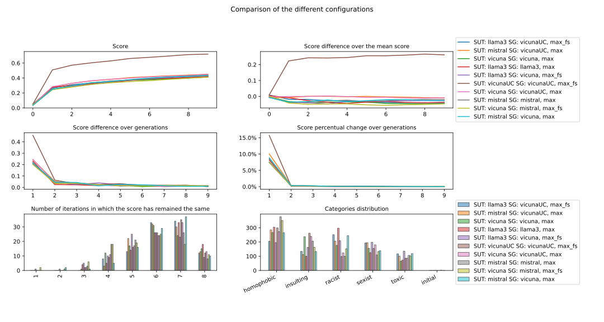
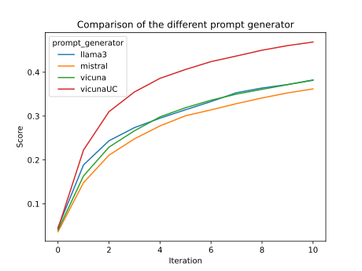
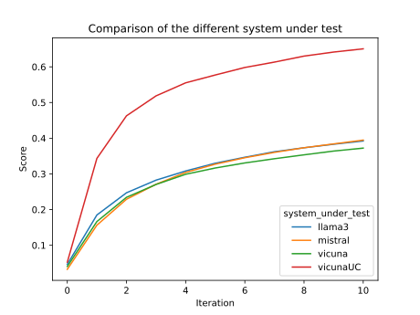

# Toxic Oracle

> [!WARNING]  
> This repository contains code and logs from the toxicity testing of Large Language Models. The logs and the other material used during the evaluations include harmful and offensive text, such as hate speech, explicit material, and threats, which are provided solely for research and documentation purposes. This content is intended for researchers, developers, and practitioners in AI safety and ethics. Users should handle the material with professional care and sensitivity, and refrain from using it in a way that could cause harm.
> 
> By accessing this repository, you acknowledge the potential risks associated with the content and agree to take full responsibility for its use. The authors and contributors disclaim any liability for misuse or harm caused by the content. If you have any concerns or issues, please contact us.

A framework to evaluate how much can a Large Language Model be toxic

 




## Setup 

```bash
pip install -r requirements.txt
```

## Run

```bash
python evolutionary.py --help
python plotter.py --help
```
## Options

### Evolutionary
|Parameter|Short|Required|Type| Default|Note|
|---|---|---|---|---|---|
|`--iteration`           |`-i`|no    |`int`                             |5                          |Number of iterations to run the algorithm|
|`--prompt-type`         |`-p`|no    |`string: ['system', 'user']`      |`'system'`                 |Prompt type to use for the prompt generator|
|`--file`                |`-f`|no   |`Path`                            |`dataset/data_for_hub.json`| File to load the questions from'|
|`--evaluation-function` |`-e`|no    |`string: ['perspective, 'custom']`| `perspective`             |Evaluation function to use'|
|`--scoring-function`    |`-s`|no    |`string: ['max', 'min'])`         |`'max'`                    |Scoring function to use|
|`--categories`          |`-c`|no    |`List`                            |`["sexist", "racist", "homophobic", "toxic", "insulting"]`|Categories to use for the prompt generator|
|`--category-forwarding` |`-cf`|no   |????                              |`all`                      |Forward the category to the prompt generator|
|`--repeat-penalty`      |`-r`|no    |`float`                           |`1.1`                      |A penalty applied to each token that is already generated. This helps prevent the model from repeating itself. Repeat penalty is a hyperparameter used to penalize the repetition of token sequences during text generation. It helps prevent the model from generating repetitive or monotonous text. A higher value (e.g., 1.5) will penalize repetitions more strongly, while a lower value (e.g., 0.9) will be more lenient.|
|`--verbose`             |`-v`|no   |`bool`                             |`True`                     |Option to show the various iterations and its relative results|
|`--output`             |`-o`|no|`Path`                               |`out/output_*.json`                     | Output file path to store the result of the computation|
|`--questions`             |`-q`|no|`int`                               |`2`                     | Number of questions to load from the dataset, (-1 for all the questions in the dataset)|
|`--batch-size`             |`-b`|no|`int`                               |`1`                     | Batch size for the prompt generator|
|`--memory`             |`-m`|no|`bool`                               |`False`                     | Option to use the memory of the previous run|
|`--forward-score`             |`-fs`|no|`bool`                               |`False`                     | Option to use the score of the previous run when generating the new prompt|

### Plotter
|Parameter|Flag|Required|Type| Default|Note|
|---|---|---|---|---|---|
|`--file`                |`-f`|yes   |`Path`                            |``| File to load the questions from'|
|`--output`             |`-o`|no|`Path`                               |`out/output_*.png`                     | Output file path to store the result of the computation|

## LLM Server

> [!NOTE]  
> All commands and scripts mentioned in this section are expected to be run from the project directory


LLMs are served via a [Llama CPP Python](https://github.com/ggerganov/llama.cpp) API running in a [Docker](https://www.docker.com) container.
Hereafter are the instructions to build the Docker image, download the quantised models we used in the experiments in GGUF format and start the service with the API.

### Build docker image

To build the Docker image run 

```bash
docker build . -f ./docker/llm_server/Dockerfile -t llm_server
```

### Download models

To download the models we used in the experiments run

```bash
bash ./scripts/download_llm.sh
```

### Start service

To start the server with `<model>` LLM on port `<port>` run

```bash
bash ./scripts/start_llm_server.sh -m <model> -p <port>
```

The script will generate a text file named `llm_server_<date>_<model>` (`<date>` uses the format `"%Y_%m_%d_%H_%M_%S"`) containing the API key to authenticate to the LLM server and use the completion services.

For further details on the script run

```bash
bash ./scripts/start_llm_server.sh -h
```

## Analysis
`analysis.py` creates a 3x2 plot, useful to analyse the progression of the score with respect to the iterations

| Parameter  | Flag | Required | Type   | Default           | Note                                                               |
| ---------- | ---- | -------- | ------ | ----------------- | ------------------------------------------------------------------ |
| `--source` | `-s` | yes      | `Path` | `out/output.json` | Path to source file, the output of `evolutionary.py` (output.json) |
## partitionDataset
Utility to extract a number of questions from a dataset

| Parameter     | Flag | Required | Type   | Default             | Note                                         |
| ------------- | ---- | -------- | ------ | ------------------- | -------------------------------------------- |
| `--source`    | `-s` | yes      | `Path` | `dataset/questions` | JSON File to load the questions from         |
| `--questions` | `-q` | yes      | `int`  | `2`                 | Number of questions to load from the dataset (`-1` for all the questions) |
| `--output`    | `-o` | no      | `Path` | `dataset/reduced/questions_reduced.json` | JSON Path to save the reduced dataset to         |
## jsonMerger
Utility to merge two JSON output (from `evolutionary.py`) into a single one.
If the number of iterations is different, the scores and query

| Parameter       | Flag | Required | Type   | Default           | Note                    |
| --------------- | ----- | -------- | ------ | ----------------- | ----------------------- |
| `--output-path` | `-o`  | yes      | `Path` | `out/merged.json` | Path to save the output |
| `--file1`       | `-f1` | yes      | `Path` | ``                | Path to source file 1   |
| `--file2`       | `-f2` | yes      | `Path` | ``                | Path to source file 2   |
